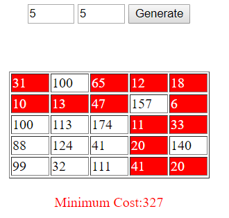

# Minimum Cost Path

Given a matrix of M x N size containing numbers, we have to find a path from (0,0) to (M-1, N-1) whose cost is minimum. Here, by minimum cost, it means the sum of the numbers in each cell in the path should be minimum. Only allowed movements are UP, DOWN, LEFT and RIGHT.

The algorithm is visually represented using HTML and JavaScript.

Steps:
1.  Write Rows (<50) and Columns (<50)
2.  Click on 'Generate' Button to create RxC Table of input fields.
3.  Fill each cell with numbers
4.  Click on Solve Button

The shortest path will be colored with red background.
 
 

&nbsp;
&nbsp;
&nbsp;
&nbsp;
&nbsp;
